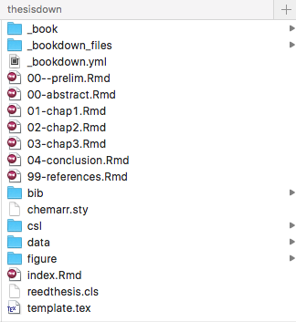

# Introduction {#intro}

Before you will be in any shape to get **R**rring you will need to download the basics. Luckily there are lots of resources that can guide you through this process. 

The following is an excerpt from the book by [\@statgarrett](https://twitter.com/statgarrett) and [\@hadleywickham](https://twitter.com/hadleywickham)  

## [R for Data Science](http://r4ds.had.co.nz/index.html)

Taken from [R for Data Science](http://r4ds.had.co.nz/index.html) and unchanged licensed under the [Creative Commons Attribution-NonCommercial-NoDerivs 3.0](http://creativecommons.org/licenses/by-nc-nd/3.0/us/) United States License. 

### R 

To download R, go to CRAN, the **c**omprehensive **R** **a**rchive **n**etwork. CRAN is composed of a set of mirror servers distributed around the world and is used to distribute R and R packages. Don't try and pick a mirror that's close to you: instead use the cloud mirror, <https://cloud.r-project.org>, which automatically figures it out for you.

A new major version of R comes out once a year, and there are 2-3 minor releases each year. It's a good idea to update regularly. Upgrading can be a bit of a hassle, especially for major versions, which require you to re-install all your packages, but putting it off only makes it worse.

### RStudio

RStudio is an integrated development environment, or IDE, for R programming. Download and install it from <http://www.rstudio.com/download>. RStudio is updated a couple of times a year. When a new version is available, RStudio will let you know. It's a good idea to upgrade regularly so you can take advantage of the latest and greatest features. For this book, make sure you have RStudio 1.0.0.

When you start RStudio, you'll see two key regions in the interface:

```{r, echo = FALSE, out.width = "75%"}
knitr::include_graphics("images/rstudio-console.png")
```

For now, all you need to know is that you type R code in the console pane, and press enter to run it. You'll learn more as we go along!

### The tidyverse

You'll also need to install some R packages. An R __package__ is a collection of functions, data, and documentation that extends the capabilities of base R. Using packages is key to the successful use of R. The packages in the tidyverse share a common philosophy of data and R programming, and are designed to work together naturally. 

You can install the complete tidyverse with a single line of code:

```{r, eval = FALSE}
install.packages("tidyverse")
```

On your own computer, type that line of code in the console, and then press enter to run it. R will download the packages from CRAN and install them on to your computer. If you have problems installing, make sure that you are connected to the internet, and that <https://cloud.r-project.org/> isn't blocked by your firewall or proxy. 

You will not be able to use the functions, objects, and help files in a package until you load it with `library()`. Once you have installed a package, you can load it with the `library()` function:

```{r, message=FALSE}
library(tidyverse)
```

This tells you that tidyverse is loading the ggplot2, tibble, tidyr, readr, purrr, and dplyr packages. These are considered to be the __core__ of the tidyverse because you'll use them in almost every analysis.

### R Markdown

R Markdown provides an unified authoring framework for data science, combining your code, its results, and your prose commentary. R Markdown documents are fully reproducible and support dozens of output formats, like PDFs, Word files, slideshows, and more. 

R Markdown files are designed to be used in three ways:

1.  For communicating to decision makers, who want to focus on the conclusions,
    not the code behind the analysis.

1.  For collaborating with other data scientists (including future you!), who
    are interested in both your conclusions, and how you reached them (i.e.
    the code).
    
1.  As an environment in which to _do_ data science, as a modern day lab 
    notebook where you can capture not only what you did, but also what you
    were thinking.

R Markdown integrates a number of R packages and external tools. This means that help is, by-and-large, not available through `?`. Instead, as you work through this chapter, and use R Markdown in the future, keep these resources close to hand:

*   R Markdown Cheat Sheet: _Help > Cheatsheets > R Markdown Cheat Sheet_,

*   R Markdown Reference Guide: _Help > Cheatsheets > R Markdown Reference 
    Guide_.

Both cheatsheets are also available at <http://rstudio.com/cheatsheets>.

## [Thesisdown](https://github.com/ismayc/thesisdown)

[Thesisdown](https://github.com/ismayc/thesisdown) is built from [Bookdown](https://bookdown.org/home/). It is a very useful tool to start working from if your goal is to submit your thesis using the language R Markdown. The [Thesisdown](https://github.com/ismayc/thesisdown) package was written by [\@Old_Man_Chester](https://twitter.com/old_man_chester) 

----

This project was inspired by the [bookdown](http://github.com/rstudio/bookdown) package and is an updated version of my Senior Thesis template in the `reedtemplates` package [here](http://github.com/ismayc/reedtemplates).

Currently, the PDF and gitbook versions are fully-functional. The word and epub versions are developmental, have no templates behind them, and are essentially calls to the appropriate functions in bookdown.

The current output for the four versions is here:

- [PDF](https://github.com/ismayc/thesisdown_book/blob/gh-pages/thesis.pdf) (Generating LaTeX file is available [here](https://github.com/ismayc/thesisdown_book/blob/gh-pages/thesis.tex) with other files at in the [book directory](https://github.com/ismayc/thesisdown_book/tree/gh-pages).)
- [Word](https://github.com/ismayc/thesisdown_book/blob/gh-pages/thesis.docx)
- [ePub](https://github.com/ismayc/thesisdown_book/blob/gh-pages/thesis.epub)
- [gitbook](http://ismayc.github.io/thesisdown_book)

Under the hood, the Reed College LaTeX template (and soon the Reed College Word template) is used to ensure that documents conform precisely to submission standards. At the same time, composition and formatting can be done using lightweight [markdown](http://rmarkdown.rstudio.com/authoring_basics.html) syntax, and **R** code and its output can be seamlessly included using [rmarkdown](http://rmarkdown.rstudio.com).

Using **thesisdown** has some prerequisites which are described below. To compile PDF documents using **R**, you are going to need to have LaTeX installed.  It can be downloaded for Windows at <http://http://miktex.org/download> and for Mac at <http://tug.org/mactex/mactex-download.html>.  Follow the instructions to install the necessary packages after downloading the (somewhat large) installer files.  You may need to install a few extra LaTeX packages on your first attempt to knit as well.

### The basic filing structure

```{r echo = FALSE, out.width = "75%"}

```

### PDF output

```{r echo = FALSE, out.width = "75%"}
knitr::include_graphics("images/reed_thesis_demo.png")
```

### YAML

```{r echo = FALSE, out.width = "75%"}
knitr::include_graphics("images/reed_yaml.png")
```


## [Blogdown](https://github.com/rstudio/blogdown)

The beauty of a platform like [Blogdown](https://github.com/rstudio/blogdown) is in its ability to transport your scientific work into the public domain with very little extra effort. A website is generated from R Markdown documents. You can include all your results, analysis, graphics and can be computed and rendered dynamically from R code to your website!

[\@xieyihui](https://twitter.com/xieyihui) and [\@Amber Thomas](https://proquestionasker.github.io/) have put together an open book using bookdown which details the process of setting up a blogdown for your own private use. A section of their book, [Creating Websites with R Markdown](https://bookdown.org/yihui/blogdown/) is included below and the online version is licensed under the [Creative Commons Attribution-NonCommercial-ShareAlike 4.0 International License](http://creativecommons.org/licenses/by-nc-sa/4.0/).  

We introduce an R package, **blogdown**, in this short book, to teach you how to create websites using R Markdown and Hugo. If you have experience with creating websites, you may naturally ask what the benefits of using R Markdown are, and how **blogdown** is different with existing popular website platforms, such as WordPress. There are two major highlights of **blogdown**:

1. It produces a static website, meaning the website only consists of static files such as HTML, CSS, JavaScript, and images, etc. You can host the website on any web servers (see Chapter \@ref(deployment) for details). The website does not require server-side scripts such as PHP or databases like WordPress does. It is just one folder of static files. We will explain more benefits of static websites in Chapter \@ref(hugo), when we introduce the static website generator Hugo.

1. The website is generated from R Markdown documents (R is optional, i.e., you can use plain Markdown documents without R code chunks). This brings a huge amount of benefits, especially if your website is related to data analysis or (R) programming. Being able to use Markdown implies simplicity and more importantly, _portability_ (e.g., you are giving yourself the chance to convert your blog posts to PDF and publish to journals or even books in the future). R Markdown gives you the benefits of dynamic documents --- all your results, such as tables, graphics, and inline values, can be computed and rendered dynamically from R code, hence the results you present on your website are more likely to be reproducible. An additional yet important benefit of using R Markdown is that you will be able to write technical documents easily, due to the fact that **blogdown** inherits the HTML output format from **bookdown** [@R-bookdown]. For example, it is possible to write LaTeX math equations, BibTeX citations, and even theorems and proofs if you want.

Please do not be misled by the word "blog" in the package name: **blogdown** is for general-purpose websites, and not only for blogs. For example, both authors of this book have their personal websites, where you can find information about their projects, blogs, package documentations, and so on.^[Yihui's homepage is at https://yihui.name. He writes blog posts in both Chinese (https://yihui.name/cn/) and English (https://yihui.name/en/), and documents his software packages such as **knitr** (https://yihui.name/knitr/) and **animation** (https://yihui.name/animation/). Occasionally he also writes articles like https://yihui.name/rlp/ when he finds interesting topics but does not bother a formal journal submission. Amber's homepage is at https://proquestionasker.github.io. Similarly, you can find her blog and project pages.] All their pages are built from **blogdown** and Hugo.

## Git and Github

The initial process of getting git sorted may be challenging but we encourage you to persist and get it set up. Again, there are several online resources which provide detailed step by steps and it is not our intention to guide you through this but rather point you towards some of the 'good' ones.

For this section we have taken content from [Happy Git and GitHub for the useR](http://happygitwithr.com/) which was written by [\@JennyBryan](https://twitter.com/JennyBryan) and licensed under [Creative Commons Attribution-NonCommercial 4.0 International License](http://creativecommons.org/licenses/by-nc/4.0/).

### Why Git?

[Git](http://git-scm.com) is a __version control system__. Its original purpose was to help groups of developers work collaboratively on big software projects. Git manages the evolution of a set of files -- called a __repository__ -- in a sane, highly structured way. If you have no idea what I'm talking about, think of it as the "Track Changes" features from Microsoft Word on steroids.

Git has been re-purposed by the data science community. In addition to using it for source code, we use it to manage the motley collection of files that make up typical data analysis projects, which often consist of data, figures, reports, and, yes, source code.

A solo data analyst, working on a single computer, will benefit from adopting version control. But not nearly enough to justify the pain of installation and workflow upheaval. There are much easier ways to get versioned back ups of your files, if that's all you're worried about.

In my opinion, **for new users**, the pros of Git only outweigh the cons when you factor in the overhead of communicating and collaborating with other people. Who among us does not need to do that? Your life is much easier if this is baked into your workflow, as opposed to being a separate process that you dread or neglect.

### Why GitHub?

This is where hosting services like [GitHub](https://github.com), [Bitbucket](https://bitbucket.org), and [GitLab](https://about.gitlab.com) come in. They provide a home for your Git-based projects on the internet.  If you have no idea what I'm talking about, think of it as DropBox but much, much better. The remote host acts as a distribution channel or clearinghouse for your Git-managed project. It allows other people to see your stuff, sync up with you, and perhaps even make changes. These hosting providers improve upon traditional Unix Git servers with well-designed web-based interfaces.

Even for private solo projects, it's a good idea to push your work to a remote location for peace of mind. Why? Because it's fairly easy to screw up your local Git repository, especially when you're new at this. The good news is that often only the Git infrastructure is borked up. Your files are just fine! Which makes your Git pickle all the more frustrating. There are official Git solutions to these problems, but they might require expertise and patience you can't access at 3a.m. If you've recently pushed your work to GitHub, it's easy to grab a fresh copy, patch things up with the changes that only exist locally, and get on with your life.

Don't get too caught up on public versus private at this point. There are many ways to get private repositories from the major providers for low or no cost. Just get started and figure out if and how Git/GitHub is going to work for you! If you outgrow this arrangement, you can throw some combination of technical savvy and money at the problem. You can either pay for a higher level of service or self-host one of these platforms.

Outside of [\@JennyBryan](https://twitter.com/JennyBryan) book you can find a detailed guide to getting **Git**ed with RStudio by [/@juliesquid](https://twitter.com/juliesquid) [here](http://jules32.github.io/2016-07-12-Oxford/git/).

## Twitterverse 

You might also want to follow these guys on Twitter: 

* Hadley Wickham [\@hadleywickham](https://twitter.com/hadleywickham) 
* Garrett Grolemund [\@statgarrett](https://twitter.com/statgarrett)
* Chester Ismay [\@Old_Man_Chester](https://twitter.com/old_man_chester)
* Yihui Xie [\@xieyihui](https://twitter.com/xieyihui)
* Jenny Bryan [\@JennyBryan](https://twitter.com/JennyBryan)
* RStudio Tips [\@rstudiotips](https://twitter.com/rstudiotips)

If you're an active Twitter user, follow the `#rstats` hashtag.

```{r include=FALSE}
# automatically create a bib database for R packages
knitr::write_bib(c(
  .packages(), 'bookdown', 'tidyverse', 'knitr', 'rmarkdown', 
  'nycflights13', 'devtools', 'ggplot2', 'webshot', 'lubridate', 
  'dygraphs', 'tufte', 'okcupiddata', 'mosaic',
   'dplyr', 'ggplot2movies', 'fivethirtyeight', 'tibble', 'readr'
), 'bib/packages.bib')
```

