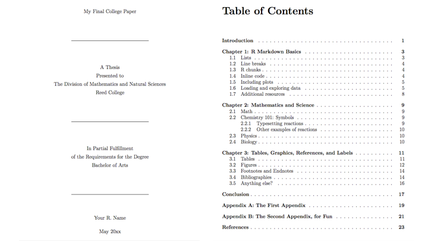

--- 
title: "WASdown"
author: "Morgan Brand and Robert Schlegel"
date: "`r Sys.Date()`"
site: bookdown::bookdown_site
output: bookdown::gitbook
documentclass: book
bibliography: 
  - bib/book.bib 
  - bib/packages.bib
biblio-style: apalike
link-citations: yes
cover-image: images/logo_bw.png
description: "This book is built as an infomration package meant for the student workshop at #WorldAqua17"
---

# Preamble {-}

This book was written using the **bookdown** R package from Yihui Xie [@R-bookdown]. It is a combination of work done by Hadley ([\@hadleywickham](https://twitter.com/hadleywickham)), Garrett ([\@statgarrett](https://twitter.com/statgarrett)) and Chester ([\@Old_Man_Chester](https://twitter.com/old_man_chester)) with some insight from the authors. This a complementory book for a workshop held at the [World Aquaculture Conference](https://www.was.org/meetings/default.aspx?code=WA2017) in Cape Town June 2017. We (the authors) hope to provide exposure to the world of R and some relevant online resources to students which will hopefully put them on track for being self tought coding aqucultureists. An introduction to using R, RStudio, and R Markdown by Chester Ismay is also available in a free book [here](http://ismayc.github.io/rbasics-book) and more in his DataCamp course at [Effective Data Storytelling using the tidyverse](https://www.datacamp.com/courses/3085). For more insight into the useage we would advice you to look through [R for Data Science](http://r4ds.had.co.nz/index.html) and [ModernDive](https://ismayc.github.io/moderndiver-book/). For an example of the role within the science workflow read the **Nature** publication [Our path to better science in less time using open data science tools](https://www.nature.com/articles/s41559-017-0160) and the extensive testing they have done.

# Colophon {-}

The source of the book is available [here](https://github.com/schrob040/R_WAS/tree/master/WASdown) and was built with versions of R packages (and their dependent packages) given below.  This may not be of importance for initial readers of this book, but the hope is you can reproduce a duplicate of this book by installing these versions of the packages.


```{r}
devtools::session_info(c("tidyverse"))
```

Book was last updated `r paste("by", Sys.info()[["user"]], "on", format(Sys.time(), "%A, %B %d, %Y %X %Z"))`.

<!--chapter:end:index.Rmd-->

# Introduction {#intro}

Before you will be in any shape to get **R**rring you will need to download the basics. There are lots of resources that can guide you through this process and surley several versions. 

Below there is an excerpt from the book by [\@statgarrett](https://twitter.com/statgarrett) and [\@hadleywickham](https://twitter.com/hadleywickham)  

## [R for Data Science](http://r4ds.had.co.nz/index.html)

Taken from [R for Data Science](http://r4ds.had.co.nz/index.html) and unchanged licenced under the [Creative Commons Attribution-NonCommercial-NoDerivs 3.0](http://creativecommons.org/licenses/by-nc-nd/3.0/us/) United States License. 

### R 

To download R, go to CRAN, the **c**omprehensive **R** **a**rchive **n**etwork. CRAN is composed of a set of mirror servers distributed around the world and is used to distribute R and R packages. Don't try and pick a mirror that's close to you: instead use the cloud mirror, <https://cloud.r-project.org>, which automatically figures it out for you.

A new major version of R comes out once a year, and there are 2-3 minor releases each year. It's a good idea to update regularly. Upgrading can be a bit of a hassle, especially for major versions, which require you to reinstall all your packages, but putting it off only makes it worse.

### RStudio

RStudio is an integrated development environment, or IDE, for R programming. Download and install it from <http://www.rstudio.com/download>. RStudio is updated a couple of times a year. When a new version is available, RStudio will let you know. It's a good idea to upgrade regularly so you can take advantage of the latest and greatest features. For this book, make sure you have RStudio 1.0.0.

When you start RStudio, you'll see two key regions in the interface:

```{r echo = FALSE, out.width = "75%"}
knitr::include_graphics("images/rstudio-console.png")
```

For now, all you need to know is that you type R code in the console pane, and press enter to run it. You'll learn more as we go along!

### The tidyverse

You'll also need to install some R packages. An R __package__ is a collection of functions, data, and documentation that extends the capabilities of base R. Using packages is key to the successful use of R. The packages in the tidyverse share a common philosophy of data and R programming, and are designed to work together naturally. 

You can install the complete tidyverse with a single line of code:

```{r, eval = FALSE}
install.packages("tidyverse")
```

On your own computer, type that line of code in the console, and then press enter to run it. R will download the packages from CRAN and install them on to your computer. If you have problems installing, make sure that you are connected to the internet, and that <https://cloud.r-project.org/> isn't blocked by your firewall or proxy. 

You will not be able to use the functions, objects, and help files in a package until you load it with `library()`. Once you have installed a package, you can load it with the `library()` function:

```{r, message=FALSE}
library(tidyverse)
```

This tells you that tidyverse is loading the ggplot2, tibble, tidyr, readr, purrr, and dplyr packages. These are considered to be the __core__ of the tidyverse because you'll use them in almost every analysis.

### R Markdown

R Markdown provides an unified authoring framework for data science, combining your code, its results, and your prose commentary. R Markdown documents are fully reproducible and support dozens of output formats, like PDFs, Word files, slideshows, and more. 

R Markdown files are designed to be used in three ways:

1.  For communicating to decision makers, who want to focus on the conclusions,
    not the code behind the analysis.

1.  For collaborating with other data scientists (including future you!), who
    are interested in both your conclusions, and how you reached them (i.e.
    the code).
    
1.  As an environment in which to _do_ data science, as a modern day lab 
    notebook where you can capture not only what you did, but also what you
    were thinking.

R Markdown integrates a number of R packages and external tools. This means that help is, by-and-large, not available through `?`. Instead, as you work through this chapter, and use R Markdown in the future, keep these resources close to hand:

*   R Markdown Cheat Sheet: _Help > Cheatsheets > R Markdown Cheat Sheet_,

*   R Markdown Reference Guide: _Help > Cheatsheets > R Markdown Reference 
    Guide_.

Both cheatsheets are also available at <http://rstudio.com/cheatsheets>.

## [Thesisdown](https://github.com/ismayc/thesisdown)

[Thesisdown](https://github.com/ismayc/thesisdown) is built from [Bookdown](https://bookdown.org/home/). It is a very useful tool to start working from if your goal is to submit your thesis using the language R Markdown. The [Thesisdown](https://github.com/ismayc/thesisdown) package was writen by [\@Old_Man_Chester](https://twitter.com/old_man_chester) 

----

This project was inspired by the [bookdown](http://github.com/rstudio/bookdown) package and is an updated version of my Senior Thesis template in the `reedtemplates` package [here](http://github.com/ismayc/reedtemplates).

Currently, the PDF and gitbook versions are fully-functional.  The word and epub versions are developmental, have no templates behind them, and are essentially calls to the appropriate functions in bookdown.

The current output for the four versions is here:

- [PDF](https://github.com/ismayc/thesisdown_book/blob/gh-pages/thesis.pdf) (Generating LaTeX file is available [here](https://github.com/ismayc/thesisdown_book/blob/gh-pages/thesis.tex) with other files at in the [book directory](https://github.com/ismayc/thesisdown_book/tree/gh-pages).)
- [Word](https://github.com/ismayc/thesisdown_book/blob/gh-pages/thesis.docx)
- [ePub](https://github.com/ismayc/thesisdown_book/blob/gh-pages/thesis.epub)
- [gitbook](http://ismayc.github.io/thesisdown_book)

Under the hood, the Reed College LaTeX template (and soon the Reed College Word template) is used to ensure that documents conform precisely to submission standards. At the same time, composition and formatting can be done using lightweight [markdown](http://rmarkdown.rstudio.com/authoring_basics.html) syntax, and **R** code and its output can be seamlessly included using [rmarkdown](http://rmarkdown.rstudio.com).

Using **thesisdown** has some prerequisites which are described below. To compile PDF documents using **R**, you are going to need to have LaTeX installed.  It can be downloaded for Windows at <http://http://miktex.org/download> and for Mac at <http://tug.org/mactex/mactex-download.html>.  Follow the instructions to install the necessary packages after downloading the (somewhat large) installer files.  You may need to install a few extra LaTeX packages on your first attempt to knit as well.

### The basic filing structure

```{r echo = FALSE, out.width = "75%"}
knitr::include_graphics("images/reed_files.png")
```

### PDF output

```{r echo = FALSE, out.width = "75%"}

```

### YAML

```{r echo = FALSE, out.width = "75%"}
knitr::include_graphics("images/reed_yaml.png")
```


## [Blogdown](https://github.com/rstudio/blogdown)

The beauty of a platform like [Blogdown](https://github.com/rstudio/blogdown) is in its ability to transport your scientific work into the public domain with very little extra effort. A website is generated from R Markdown documents. You can include all your results, analysis, graphics andcan be computed and rendered dynamically from R code to your website!

[\@xieyihui](https://twitter.com/xieyihui) and [\@Amber Thomas](https://proquestionasker.github.io/) have put together an open book using bookdown which details the process of setting up a blogdown for your own prive use. A section of their book, [Creating Websites with R Markdown](https://bookdown.org/yihui/blogdown/) is included below and the online version is licensed under the [Creative Commons Attribution-NonCommercial-ShareAlike 4.0 International License](http://creativecommons.org/licenses/by-nc-sa/4.0/).  

We introduce an R package, **blogdown**, in this short book, to teach you how to create websites using R Markdown and Hugo. If you have experience with creating websites, you may naturally ask what the benefits of using R Markdown are, and how **blogdown** is different with existing popular website platforms, such as WordPress. There are two major highlights of **blogdown**:

1. It produces a static website, meaning the website only consists of static files such as HTML, CSS, JavaScript, and images, etc. You can host the website on any web servers (see Chapter \@ref(deployment) for details). The website does not require server-side scripts such as PHP or databases like WordPress does. It is just one folder of static files. We will explain more benefits of static websites in Chapter \@ref(hugo), when we introduce the static website generator Hugo.

1. The website is generated from R Markdown documents (R is optional, i.e., you can use plain Markdown documents without R code chunks). This brings a huge amount of benefits, especially if your website is related to data analysis or (R) programming. Being able to use Markdown implies simplicity and more importantly, _portability_ (e.g., you are giving yourself the chance to convert your blog posts to PDF and publish to journals or even books in the future). R Markdown gives you the benefits of dynamic documents --- all your results, such as tables, graphics, and inline values, can be computed and rendered dynamically from R code, hence the results you present on your website are more likely to be reproducible. An additional yet important benefit of using R Markdown is that you will be able to write technical documents easily, due to the fact that **blogdown** inherits the HTML output format from **bookdown** [@R-bookdown]. For example, it is possible to write LaTeX math equations, BibTeX citations, and even theorems and proofs if you want.

Please do not be misled by the word "blog" in the package name: **blogdown** is for general-purpose websites, and not only for blogs. For example, both authors of this book have their personal websites, where you can find information about their projects, blogs, package documentations, and so on.^[Yihui's homepage is at https://yihui.name. He writes blog posts in both Chinese (https://yihui.name/cn/) and English (https://yihui.name/en/), and documents his software packages such as **knitr** (https://yihui.name/knitr/) and **animation** (https://yihui.name/animation/). Occasionally he also writes articles like https://yihui.name/rlp/ when he finds interesting topics but does not bother a formal journal submission. Amber's homepage is at https://proquestionasker.github.io. Similarly, you can find her blog and project pages.] All their pages are built from **blogdown** and Hugo.

## Git and Github

The initial process of getting gited is sometimes challenging but we encourage you to pursist and get it set up. Again, there are several online resources which provide detailed step by steps and it is not our intention to guide you through this but rather point you towards some of the 'good' ones.

For this section we have taken content from [Happy Git and GitHub for the useR](http://happygitwithr.com/) which was written by [\@JennyBryan](https://twitter.com/JennyBryan) and licenced under [Creative Commons Attribution-NonCommercial 4.0 International License](http://creativecommons.org/licenses/by-nc/4.0/).

### Why Git?

[Git](http://git-scm.com) is a __version control system__. Its original purpose was to help groups of developers work collaboratively on big software projects. Git manages the evolution of a set of files -- called a __repository__ -- in a sane, highly structured way. If you have no idea what I'm talking about, think of it as the "Track Changes" features from Microsoft Word on steroids.

Git has been re-purposed by the data science community. In addition to using it for source code, we use it to manage the motley collection of files that make up typical data analytical projects, which often consist of data, figures, reports, and, yes, source code.

A solo data analyst, working on a single computer, will benefit from adopting version control. But not nearly enough to justify the pain of installation and workflow upheaval. There are much easier ways to get versioned back ups of your files, if that's all you're worried about.

In my opinion, **for new users**, the pros of Git only outweigh the cons when you factor in the overhead of communicating and collaborating with other people. Who among us does not need to do that? Your life is much easier if this is baked into your workflow, as opposed to being a separate process that you dread or neglect.

### Why GitHub?

This is where hosting services like [GitHub](https://github.com), [Bitbucket](https://bitbucket.org), and [GitLab](https://about.gitlab.com) come in. They provide a home for your Git-based projects on the internet.  If you have no idea what I'm talking about, think of it as DropBox but much, much better. The remote host acts as a distribution channel or clearinghouse for your Git-managed project. It allows other people to see your stuff, sync up with you, and perhaps even make changes. These hosting providers improve upon traditional Unix Git servers with well-designed web-based interfaces.

Even for private solo projects, it's a good idea to push your work to a remote location for peace of mind. Why? Because it's fairly easy to screw up your local Git repository, especially when you're new at this. The good news is that often only the Git infrastructure is borked up. Your files are just fine! Which makes your Git pickle all the more frustrating. There are official Git solutions to these problems, but they might require expertise and patience you can't access at 3a.m. If you've recently pushed your work to GitHub, it's easy to grab a fresh copy, patch things up with the changes that only exist locally, and get on with your life.

Don't get too caught up on public versus private at this point. There are many ways to get private repositories from the major providers for low or no cost. Just get started and figure out if and how Git/GitHub is going to work for you! If you outgrow this arrangement, you can throw some combination of technical savvy and money at the problem. You can either pay for a higher level of service or self-host one of these platforms.

Outside of [\@JennyBryan](https://twitter.com/JennyBryan) book you can find a detailed guide to getting **Git**ed with RStudio by [/@juliesquid](https://twitter.com/juliesquid) [here](http://jules32.github.io/2016-07-12-Oxford/git/).

## Twitterverse 

You might also want to follow these guys on Twitter: 

* Hadley Wickham [\@hadleywickham](https://twitter.com/hadleywickham) 
* Garrett Grolemund [\@statgarrett](https://twitter.com/statgarrett)
* Chester Ismay [\@Old_Man_Chester](https://twitter.com/old_man_chester)
* Yihui Xie [\@xieyihui](https://twitter.com/xieyihui)
* Jenny Bryan [\@JennyBryan](https://twitter.com/JennyBryan)
* RStudio Tips [\@rstudiotips](https://twitter.com/rstudiotips)

If you're an active Twitter user, follow the `#rstats` hashtag.

```{r include=FALSE}
# automatically create a bib database for R packages
knitr::write_bib(c(
  .packages(), 'bookdown', 'tidyverse', 'knitr', 'rmarkdown', 
  'nycflights13', 'devtools', 'ggplot2', 'webshot', 'lubridate', 
  'dygraphs', 'tufte', 'okcupiddata', 'mosaic',
   'dplyr', 'ggplot2movies', 'fivethirtyeight', 'tibble', 'readr'
), 'bib/packages.bib')
```


<!--chapter:end:01-intro.Rmd-->

# Petrol

This report shows analyses performed and figures created from 10+ years of petrol usage with a 2003 Volkswagen Polo sedan (1.4).

## Loading the data

```{r, message=FALSE}
# Load libraries
library(tidyverse)
library(lubridate)
library(broom)

# Load data
petrol <- read.csv("data/petrol_info.csv")
#petrol <- read.csv("~/R_WAS/petrol_info.csv")

# Correct date
petrol$date <- as.Date(petrol$date, "%d-%m-%y")

# Correct 'full' categorical label
petrol$full[is.na(petrol$full)] <- 0
petrol$full <- factor(petrol$full, labels = c("no", "yes"))
petrol$full <- factor(petrol$full, levels = c("yes", "no"))

# Remove problem rows
petrol <- petrol[complete.cases(petrol),]

# Add month and year columns
petrol$month <- floor_date(petrol$date, "month")
petrol$year <- floor_date(petrol$date, "year")

```


## Graphical observations

Over the lifespan of a vehicle, one constant will always be the increasing count of the odometre. We may plot this as a time series.

```{r, message=FALSE, warning=FALSE, fig.cap="Line graph showing total distance traveled (km) over time."}
ggplot(data = petrol, aes(x = date, y = odom)) +
  geom_line() +
  geom_point() +
  scale_y_continuous(breaks = seq(80000, 200000, 20000)) +
  labs(y = "distance (km)", x = "")
```

Also of interest is how far the distances between fill ups may be. There are a couple of gaps in this time series, which lend themselves to some dramatic numbers, but overall we are able to get an idea of the true distances.

```{r, message=FALSE, warning=FALSE, fig.cap="Same as previous figure with the total distance between fill ups shown with a blue line."}
# Create a column showing distance between fill-ups
petrol$dist <- c(0,diff(as.matrix(petrol$odom)))

# Total distance traveled
petrol$dist_total <- petrol$odom-petrol$odom[1]

# Histogram
ggplot(data = petrol, aes(x = date, y = odom)) +
  geom_line() +
  geom_point() +
  geom_line(aes(y = dist), colour = "blue") +
  scale_y_continuous(breaks = seq(0, 200000, 40000)) +
  labs(y = "distance (km)", x = "")
```

This blue line would provide more useful information if visualised as a histogram.

```{r, message=FALSE, warning=FALSE, fig.cap="Histogram showing the distances traveled between fillings. Any values over 1,000km were subsetted out."}
ggplot(data = petrol[petrol$dist <= 1000,], aes(x = dist)) +
  geom_histogram(fill = "violet", colour = "grey40")
```

This histogram shows a bimodal distribution with a clustering of distances around 100 kms and 600 kms. This is not so strange if you think about it as it shows that this driver would tend to either go short distance between filling up, or long distances. This is likely linked to spending behaviours, which is the next thing to investigate.

## Spending patterns
We may produce another histogram to plot the amount of money spent per visit to the petrol station.

```{r, message=FALSE, warning=FALSE, fig.cap="Histogram showing the amount of money spent per visit to the petrol station. The colours show if the tank was filled during that visit or not."}
ggplot(data = petrol, aes(x = cost)) +
  geom_histogram(aes(fill = full), colour = "grey40") +
  labs(x = "Price (R)")
```

The distribution shown in this histogram is also not surprising if one thinks about it. This histogram is showing two different spending habits. On the left hand side we see that there are distinct columns rising out from the others. This is when the driver went to the station and spent specifically, R20, R50, R100, R200, R300 or R400. On the right hand side of the histogram we see a more normal distribution of columns. These are the prices spent when filling up the tank to full. 

## Petrol usage per km
One of the first things any car owner wants to know about their vehicle is the mileage their vehicle is getting. And whether or not this is decreasing with wear. Because we don't know exactly how much petrol is used between each fill up this becomes a bit tricky. We overcome this challenge by creating annual sums of petrol use. With these we may then calculate the distance traveled per litre more broadly. Monthly means are too erratic to be useful.

```{r, warning=FALSE, message=FALSE}
# Create monthly means
petrol_annual <- petrol %>%
  select(-full, -date, -month) %>%
  group_by(year) %>%
  mutate(dist2 = sum(dist)) %>% 
  mutate(litre2 = sum (litre)) %>% 
  summarise_all(mean) %>% 
  mutate(dist_litre = dist2/litre2)

# Remove outliers caused during absences
is.na(petrol_annual$dist_litre) <- petrol_annual$dist_litre > 16

# Plot it
ggplot(data = petrol_annual, aes (x = year, y = dist_litre)) +
  geom_line() +
  geom_point() +
  geom_smooth(colour = "red") +
  geom_smooth(method = "lm")

```

As we may see, the mileage appears to increase until 2013 when it then falls precipitously. The overall change in mileage for this car appears flat when modeled linearly.

## Petrol prices
Of interest to everyone is the price of petrol. Both how much we have spent and how much we have to spend every time we pull up to the station. First we see a lolliplot of spending behaviour.

```{r}
# Calculate total amount spent
petrol$cost_total <- cumsum(petrol$cost)

# Lolli plot
ggplot(data = petrol, aes(x = date, y = cost)) +
  geom_point() +
  geom_segment(aes(xend = date, y = 0, yend = cost)) +
  labs(y = "cost (R)", x = "")

```

```{r}
ggplot(data = petrol, aes(x = date, y = cost_total)) +
  geom_line() +
  geom_point() 
```


And then the price per litre averaged per month.

```{r, warning =FALSE}
# Price/ litre/ month
petrol_monthly <- petrol %>%
  select(-full, -date, -year) %>%
  group_by(month) %>%
  summarise_all(mean) %>% 
  mutate(price_litre = cost/litre)

# Fill in missing months
month_index <- data.frame(month = seq(petrol_monthly$month[1], petrol_monthly$month[nrow(petrol_monthly)], by = "month"))
petrol_monthly <- merge(petrol_monthly, month_index, by = "month", all.y = TRUE)

petrol_trend <- lm(petrol_monthly$price_litre ~ seq(1:nrow(petrol_monthly)))
petrol_augment <- augment(petrol_trend)
petrol_tidy <- tidy(petrol_trend)
petrol_glance <- glance(petrol_trend)
petrol_tidy$estimate[2]*12
# R 0.72/ month

# Line graph
ggplot(data = petrol_monthly, aes(x = month, y = price_litre)) +
  geom_line() +
  geom_point() +
  geom_smooth(method = "lm") +
  geom_text(aes(x = as.Date("2009-01-01"), y = 13, 
                label = paste0("Increase = R", round(petrol_tidy$estimate[2]*12, 2), " /month"))) +
  # geom_point(data = petrol[187,], colour = "red")
  # scale_y_continuous(breaks = seq(80000, 200000, 20000)) +
  labs(y = "price/ litre", x = "")
```

<!--chapter:end:02-petrol.Rmd-->

# Bananas

On my farm we have a total of 40 hectares of land. Of this 18 hectares is natural forest with 16 hectares of sugar can and 6 hectares of bananas. Bananas grow throughout the year and from sucker to fruit is approximately 18 months. Under field management practices we are able to maintain three stages of banana trees on each spot thereby decreasing the time to fruit to six month intervals. It is recommended that every 10 years the field is to be replanted to maximize production however, these banana fields have not been replanted recently and it is our intention to investigate what this may mean for the production. 

## Loading the data

I transcribe my raw data into Microsoft Excel from the books. For me this is the easiest way to meticulously enter data and when the data sets are not to large finding errors can be done by changing the sort and filter functions within MS Excel. Once I am ready to import data into RStudio the file is saved as a `.csv` file using the MS Excel drop down option in the save menu. Data are easiest to work with when it is in long format, i.e.. each row represents a single observation. This is not crucial because it can be transformed using R.

```{r load, message=FALSE}
# Load the relevant packages for loading and manipulaiton
library(tidyverse)

# Read in the data using `readr` from the `tidyverse` package
production <- read_csv("data/Banana Production.csv")

# A quick look to make sure the data looks like we expect
head(production)

```

Once the data are loaded and looks like the right stuff I get on to making sure my columns are set as either `date`, `factor`, or `number`. There are multiple ways to do this but I like to use **lubridate** [@R-lubridate] when working with dates and the **Tidyverse** group namely **dplyr** [@R-dplyr] for creating factors.

### Setting date 

```{r, message=FALSE}
# Load lubridate to play with the data values
library(lubridate)

# Making the date coloumn actual date values
production$Date <- as.Date(production$Date, "%m/%d/%y")

# I might want to have the month and year as unique values so I have created floor dates for each
# Add month and year columns
production$month <- floor_date(production$Date, "month")
production$year <- floor_date(production$Date, "year")

```

## tidyverse

The fields were recorded as numbers but I would rather have the prefixed by 'f' so that I do not confuse them with production.

```{r}
dat <- production
```


## Plotting bunches per month

### Bunches per month

If we were to try an plot the data for number of bunches harvested per month we can start to see that there is some kind of cyclic trend (Figure \@ref(fig:plota)). On the plot I added a smooth (a model) in blue but there seems to be a problem with what it is doing. To have a look at what this problem might be I will inspect the data frame and trouble shoot

```{r plota, message=FALSE, warning=FALSE, fig.cap="Bar graph showing the number of banana bunches harvested per month."}
names(dat)
ggplot(data = dat, aes(x = month, y = Bunches)) +
  geom_bar(stat = "identity") +
  geom_smooth(method = "loess", span = 0.2) +
  scale_x_date(date_breaks = "3 month", date_labels = "%b %y") +
  theme(axis.text.x = element_text(angle=90, vjust = 0.5)) +
  labs(y = "Banana bunches", x = "Time")
```

#### Problematic smooth

```{r}
# The str function allows you to see both the variable type and the values.
str(dat)

# Open the dat data frame from the environment panel
```

After looking at both the `str` and the data frame the problem is that `Bunches` are not being summed by month. This is an easy fix


### Bunches per month

If we want to create a summary data set to only include the sum total of banana bunches per month we can simply use `dplyr` and the pipe function. This creates a sum total for bunches.month^-1^ and the blue line now fits the plot more appropriately (Figure \@ref(fig:plotb))

```{r}
names(dat)
# Using dply to group the data by month and year, create a new column for the sum of bunches picked per month, then ungroup
dat.sum_m <- 
  dat %>%
  group_by(month, year) %>%
  summarise(bunches.m = sum(Bunches)) %>%
  ungroup()
```

```{r plotb, message=FALSE, warning=FALSE, fig.cap="Bar graph showing the sum of banana bunches harvested per month with a smooth fitted in blue."}

# Plotting the data

ggplot(data = dat.sum_m, aes(x = month, y = bunches.m)) +
  geom_bar(stat = "identity") +
  geom_smooth(method = "loess", span = 0.2) +
  scale_x_date(date_breaks = "3 month", date_labels = "%b %y") +
  theme(axis.text.x = element_text(angle=90, vjust = 0.5)) +
  labs(y = "Banana bunches", x = "Time")
```

From the trend observed in Figure \@ref(fig:plotb) it seems apparent that there may be differences in the monthly output which we could look at. 

```{r}
# I am going to modify an existing dataframe so I will assign it to 'a' as to not back track
 a <- dat.sum_m

# The month and year are going to be pulled out of the date and given their own coloumn
a$y<-year(a$year)
a$m<-month(a$month)

# If I want to use the month as anything other than a date I should tell R it is a factor
a1 <-
  a %>%
  mutate(m = as.factor(m))

```

Now that the data are ready to be looked at as bunches per month a simple box plot can tell a quick visual story 

```{r boplot, fig.cap="Boxplot showing the total banana bunches harvested per month."}
# a quick boxplot for the bunches harvested per month
ggplot(data = a1, aes(x = m, y = bunches.m)) +
  geom_boxplot() +
  geom_jitter() +
  labs(y = "Banana bunches", x = "Month")

```

### Statistics

Are the number of bunches harvest per month statistically different?

To answer this we will run a quick one-way ANOVA

```{r}
library(broom)
aov <- aov(bunches.m ~ m, data = a1)
summary(aov)
TukeyHSD(aov)

# The tidyed
tidy(aov)
tidy(TukeyHSD(aov))
```


## Plotting bunches per field

```{r}
# Creating a cum for each month grouped by field
names(dat)
dat.sum_m.f <- 
  dat %>%
  group_by(month, year, Field) %>%
  summarise(bunches.m.f = sum(Bunches))
```

As described earlier there are different fields which are picked from. A look at the production of bunches by field in Figure \@ref(fig:plotf) highlights the fact the two fields (f102 and f93) were taken out of production.

```{r plotf, message=FALSE, warning=FALSE, fig.cap="Bar graph showing the sum of banana bunches harvested per month per field with a smooth fitted in blue."}

ggplot(data = dat.sum_m.f, aes(x = month, y = bunches.m.f)) +
  geom_bar(stat = "identity") +
  geom_smooth(method = "loess", span = 0.2) +
  scale_x_date(date_breaks = "12 month", date_labels = "%y") +
  theme(axis.text.x = element_text(angle=90, vjust = 0.5)) +
  labs(y = "Banana bunches", x = "Year") +
  facet_wrap(~Field, ncol = 2)
```

### Cumulative bunches per field

It seems interesting to look at a field as a continuous unit and measure the cumulative harvest over time. 

```{r}
# Creating a cumulative bunches harvest for each field
names(dat)
dat.sum_f <- 
  dat %>%
  group_by(Field) %>%
  mutate(cumsum = cumsum(Bunches))
```

In Figure \@ref(fig:plot-line) the cumulative number of bunches harvested for each field highlights that they are not all performing the same. We could quickly add a linear model to this to further visualize the trend.

```{r plot-line, message=FALSE, warning=FALSE, fig.cap="Line graph showing the cumulative harvest for banana bunches per field."}

ggplot(data = dat.sum_f, aes(x = Date, y = cumsum, colour = Field)) +
  geom_line() +
  #geom_bar(stat = "identity") +
  #geom_smooth(method = "lm") +
  #scale_x_date(date_breaks = "12 month", date_labels = "%y") +
  #theme(axis.text.x = element_text(angle=90, vjust = 0.5)) +
  labs(y = "Banana bunches", x = "Year") 
  #facet_wrap(~Field, ncol = 2)

```


### Cumulative weight per field

It seems interesting to look at a field as a continuous unit and measure the cumulative harvest over time. 

```{r}
# Creating a cumulative bunches harvest for each field
names(dat)
dat.sum_f.w <- 
  dat %>%
  group_by(Field) %>%
  mutate(cumsum = cumsum(weight))
```

```{r plotnormalize,}
names(dat.sum_f.w)
ggplot(data = dat.sum_f.w, aes(x = Date, y = cumsum, colour = Field)) +
  geom_line() +
  #geom_bar(stat = "identity") +
  geom_smooth(method = "lm") +
  #scale_x_date(date_breaks = "12 month", date_labels = "%y") +
  #theme(axis.text.x = element_text(angle=90, vjust = 0.5)) +
  labs(y = "Weight (kg)", x = "Year") +
  scale_y_continuous(breaks = seq(0, 400000, 50000)) +
  theme_bw()
  #facet_wrap(~Field, ncol = 2)
```

The awesome thing about this is that you can very easily turn a plot into something more than just a plot using `plotly`

```{r plotly}
#devtools::install_github("ropensci/plotly")
#devtools::install_github("hadley/ggplot2")
library(plotly)

plotly <- ggplot(data = dat.sum_f.w, aes(x = Date, y = cumsum, colour = Field)) +
  geom_line() +
  #geom_bar(stat = "identity") +
  geom_smooth(method = "lm") +
  #geom_smooth(method = "loess", span = 0.1) +
  #scale_x_date(date_breaks = "12 month", date_labels = "%y") +
  #theme(axis.text.x = element_text(angle=90, vjust = 0.5)) +
  labs(y = "Weight (kg)", x = "Year") +
  scale_y_continuous(breaks = seq(0, 400000, 50000)) +
  theme_bw()
  #facet_wrap(~field, ncol = 2)

ggplotly(plotly)
```


```{r}
library(nlme)
bananas.lm <- lm(tonnage ~ field, data = norm.dat.l)
tidy(bananas.lm)
```


<!--chapter:end:03-bananas.Rmd-->

# Final Words

To summarize

<!--chapter:end:04-summary.Rmd-->

`r if (knitr:::is_html_output()) '# References {-}'`

<!--chapter:end:05-references.Rmd-->

