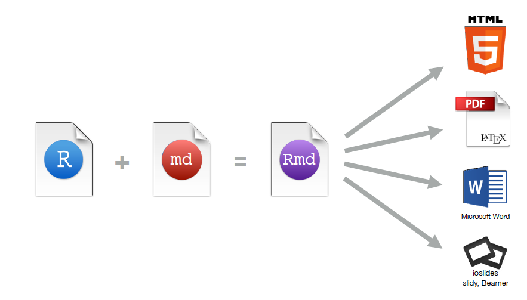

## The use of R Rstudio and Github | An introduction to reproducible workflows in R

<div class="columns-2">


Morgan Brand [\@Morgs_John](https://twitter.com/Morgs_John)
    + PhD student [UCT](http://www.uct.ac.za/)

`#WorldAqua17`

Robert Schlegel [\@wiederweiter](https://twitter.com/wiederweiter)
    + PhD student [UWC](https://www.uwc.ac.za/Pages/default.aspx)


## Why?

<div align="center">

</div>


## The relevant not so distant past

<div class="columns-2">


For working -
[R](https://www.r-project.org/)

For writing -
[Latex](https://www.latex-project.org/)

For tracking -
[Git](https://git-scm.com/)

## The present and the future
<div class="columns-2">


For working -
[RStudio](https://www.rstudio.com/)

For wrangling -
[tidyverse](http://tidyverse.org/)

For writing -
[R Markdown](http://rmarkdown.rstudio.com/)
  + [Bookdown](https://bookdown.org/home/)
  + [Thesisdown](https://github.com/ismayc/thesisdown)
  + [Blogdown](https://github.com/rstudio/blogdown)

For collaborating -
[Github](https://github.com/)

## 'modern' scientists?
<div class="columns-2">


### Roles


<div class="notes">
We can add more points to this during the session which we push to Git as part of the Demo
</div>


## A tradional approach to the scientific method

1) Devise a fancy question and call it a hypothesis

2) Formulate a means of collecting the relevant data

3) Import data set into statistical software package

4) Run the procedure to get results

5) Copy and paste appropriate pieces from the analysis into document editor

6) Add descriptions

7) Finish/submit report for comments

      **REPEAT** steps 2 - 7 after receiving comments indefinately..


## Disadvantages ot this process

* The process of data capture is not open

* Lots of manual work (prone to make errors)

* Tedious (who likes to carefully copy-and-paste?)

* Likely not recordable (did you write down all the steps you followed to get your analysis?)

* What if you made an error at the beginning of your analysis? If your data had an error? If your hypothesis was biased?

## Why R?
* [R](https://www.r-project.org/) is a free software package for statistical analysis and graphics.

* It excels in helping you with:
    + data manipulation
    + automation
    + reproducibility
    + improved accuracy
    + error finding
    + customizability
    + beautiful visualizations
    + Any downsides?

<div class="notes">
We can add more points to this during the session which we push to Git as part of the Demo
</div>

## R, R console and RStudio

* R (programming language) is a programming language and environment, "made by statistician and for statistician"

* [R](https://www.r-project.org/) console is an older version that favours the command line programmer

* [RStudio](https://www.rstudio.com/) is an Integrated Development Environment (IDE) that helps you develop programs in R

You can use R without using RStudio, but you can't use RStudio without using R


## Tidyverse in R

Tidying is the act of converting “messy” into “tidy” data frames

<div align="center">

</div>

## Tidyverse in R

The [tidyverse](http://tidyverse.org/) is a set of packages that work in harmony

The core tidyverse packages are:

* [ggplot2](http://ggplot2.org/), for data visualisation.
* [dplyr](https://github.com/tidyverse/dplyr), for data manipulation.
* [tidyr](https://github.com/tidyverse/tidyr), for data tidying.
* [readr](https://github.com/tidyverse/readr), for data import.
* [purrr](https://github.com/tidyverse/purrr), for functional programming.
* [tibble](https://github.com/tidyverse/tibble), for tibbles, a modern re-imagining of data frames.

It also installs a selection of other tidyverse packages

## R Markdown?
<div align="center">

</div>

## R Markdown?

* “Literate programming”

* Embed R code in a Markdown document

* Renders textual output along with graphics

* You can write your entire paper/report (text, code, analysis, graphics, etc.) all in [R Markdown](http://rmarkdown.rstudio.com/).

## R Markdown?
<div align="center">

</div>


## Bookdown with R Markdown

<div align="center">

</div>

## Bookdown with R Markdown

[Bookdown](https://bookdown.org/home/) is one of the more recent additions to the R-universe. 

Some highlights are:

* Multiple output formats

* Focus on writing the content not typesetting

* Readers can interact with examples

* Feedback and contributions as the book is developed

* Integrates with version control

## Thesisdown with R Markdown

[Thesisdown](https://github.com/ismayc/thesisdown) is built from [Bookdown](https://bookdown.org/home/)

The current output for the four versions is here:

* PDF
* Word
* ePub
* HTML and Gitbook

## Thesisdown with R Markdown - Files
<div align="center">

</div>

## Thesisdown with R Markdown - PDF
<div align="center">

</div>

## Thesisdown with R Markdown - YAML
<div align="center">

</div>

## Blogdown with R Markdown

You can now increase your on-line voice using tools developed in your research methods and present them as a blog!

* The R package [Blogdown](https://github.com/rstudio/blogdown) allows you to create websites using R Markdown 

The website is generated from R Markdown documents

* all your results
* analysis 
* graphics

can be computed and rendered dynamically from R code to your website!

## Blogdown with R Markdown [Yihui Xie](https://yihui.name/)

<div align="center">

</div>

## Blogdown with R Markdown [Amber Thomas](https://proquestionasker.github.io/)

<div align="center">

</div>

## Blogdown with R Markdown [Amber Thomas](https://proquestionasker.github.io/)

<div align="center">

</div>

## Git?
<div align="center">

</div>

## Git and Github

[Git](https://git-scm.com/) is a version control system that lets you track changes to files over time

* Git manages the evolution of a set of files – called a repository

[Github](https://github.com/) is a website for storing your git versioned files remotely

* Github provides a home for your Git-based projects on the internet

* If you are a student you can get the micro account which includes 5 private repositories for free!


## Github

<div align="center">

</div>

## Reproducible Research {#nextsteps .emphasized}
“Let us change our traditional attitude to the construction of programs: Instead of imagining that our main task is to instruct a computer what to do, let us concentrate rather on explaining to humans what we want the computer to do.”

**Donald Knuth, *Literate Programming* (1984)**

## Reproducible Research {#nextsteps .emphasized}
“Reproducible research is the idea that data analyses, and more generally, scientific claims, are published with their data and software code so that others may verify the findings and build upon them.”

**Roger Peng, Johns Hopkins**

## Session info

```{r}
sessionInfo()
```

## Thanks and references

I would like to Thank [\@Old_Man_Chester](http://ismayc.github.io/) and his [RPubs](http://www.rpubs.com/cismay) slides

<style>
slides > slide { overflow: scroll; }
slides > slide:not(.nobackground):after {
  content: '';
}
</style>

[Thesisdown](https://github.com/ismayc/thesisdown)

[Bookdown](https://bookdown.org/home/)

[Authoring Books with R Markdown](https://bookdown.org/yihui/bookdown/)

[R4DS](http://r4ds.had.co.nz/)

[Happy Git and GitHub for the useR](http://happygitwithr.com/)

[ModernDive](https://ismayc.github.io/moderndiver-book/index.html)

[Presentations with ioslides](http://rmarkdown.rstudio.com/ioslides_presentation_format.html#code_highlighting)

[Our path to better science in less time using open data science tools](https://www.nature.com/articles/s41559-017-0160)

[Creating Websites with R Markdown](https://bookdown.org/yihui/blogdown/)

[Yihui Xie - On Formality](https://yihui.name/en/2017/06/on-formality/)

[Amber Thomas](https://proquestionasker.github.io/)

[GitHub](https://github.com/logos)

[RStudio](https://www.rstudio.com/)

[Blogdown](https://github.com/rstudio/blogdown)


