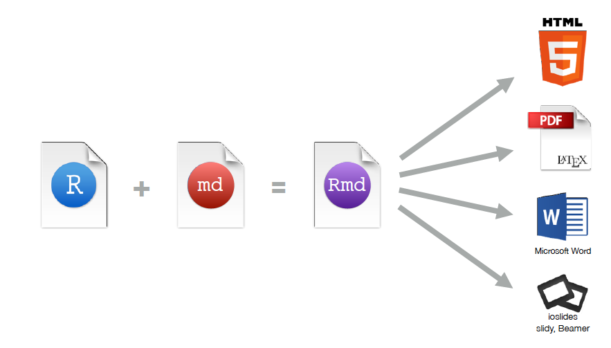
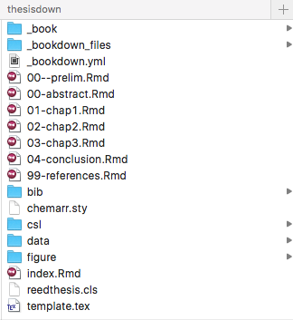
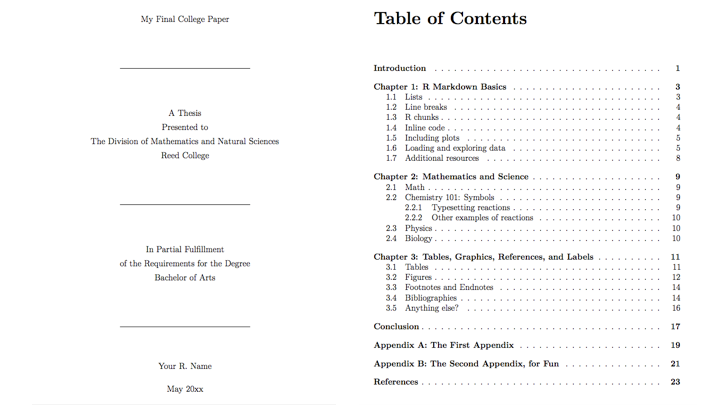
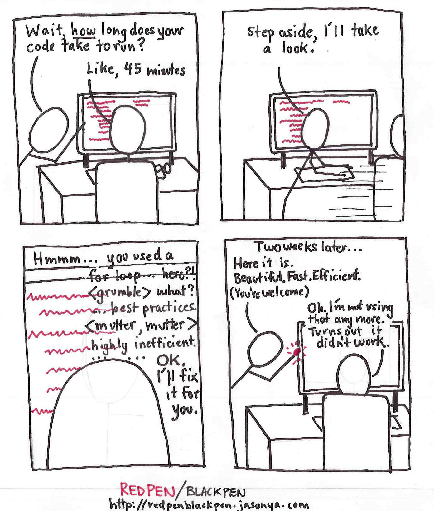
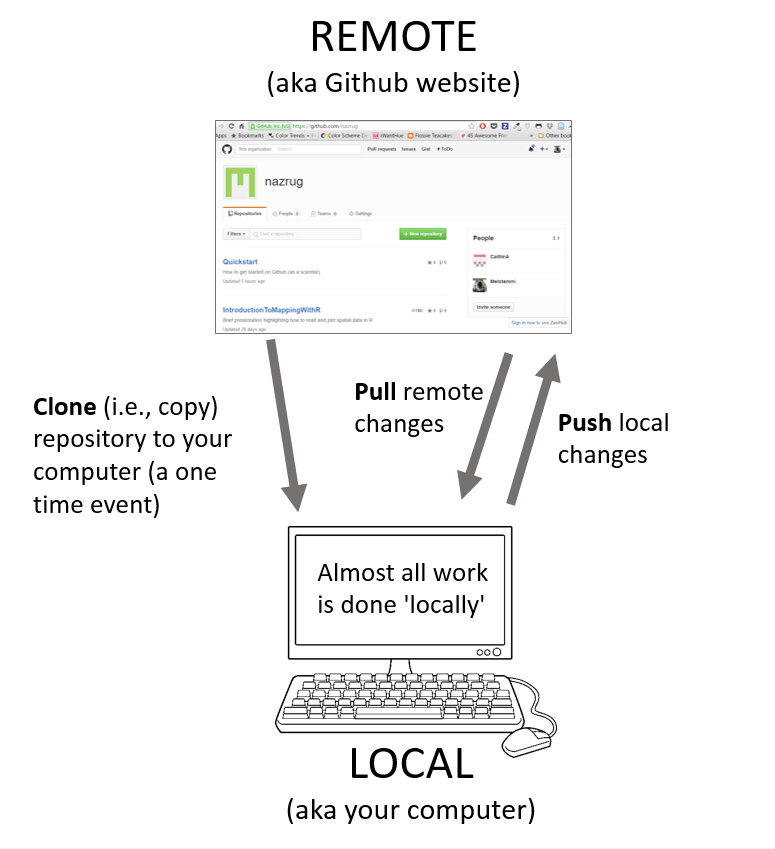

## Who are we?

### Robert Schlegel 
My name is rob and I love fish and kelp

### Morgan Brand
* PhD student at the University of Cape Town
* Interests = aquaculture, microbiolgy, reproducibility and collaboration

## Todays "Order of Permanance"

### The relevant not so distant past
1) R
2) Latex - Sweave
3) Git

*Continued...*

## Todays "Order of Permanance"
### The present and future
4) Rstudio
5) R Markdown
    + Bookdown
    + Thesisdown
    + Blogdown
6) GitHub

## Some roles of a 'modern' scientist are?
* Communication
    + Twitter
    + Popular articles
    + Public speaking
* Interdiciplinary work
* Collaboration
    + Beyond your lab

We can add more points to this during the session which we push to Git as part of the Demo

## The tradional approach to the scientific method
1) Devise a fancy question and call it a hypothesis

2) Formulate a means of collecting the relevant data

3) Import data set into statistical software package

4) Run the procedure to get results

5) Copy and paste appropriate pieces from the analysis into document editor

6) Add descriptions

7) Finish/submit report for comments

      **REPEAT** steps 2 - 7 after receiving comments indefinately..

## Disadvantages ot this process
* The process of data capture is not open

* Lots of manual work (prone to make errors)

* Tedious (who likes to carefully copy-and-paste?)

* Likely not recordable (did you write down all the steps you followed to get your analysis?)

* What if you made an error at the beginning of your analysis? If your data had an error? If your hypothesis was biased?

## Why R?
* R is a completely free software package and language for statistical analysis and graphics.

* It excels in helping you with
    + data manipulation
    + automation
    + reproducibility
    + improved accuracy
    + error finding
    + customizability
    + beautiful visualizations
    + Any downsides?

## R vs. RStudio

**R** is an older version that favours the command line programmer

**RStudio** is a powerful user interface that helps you get better control of your analysis.

* Like R, it is also completely free.

* You can write your entire paper/report (text, code, analysis, graphics, etc.) all in a language called R Markdown.

* If you need to update any of your code, R Markdown will automatically update your plots and output of your analysis and will create an updated PDF file.

* No more copy-and-paste!

## What is R Markdown?
* “Literate programming”
* Embed R code in a Markdown document
* Renders textual output along with graphics

## What is R Markdown?

## What is R Markdown?

## Bookdown with R Markdown
Bookdown is one of the more recent additions to the R ecosystem/ universe which allows you to:

* Write a book in one source format, and generate the output to multiple formats

* Focus on writing the content without worrying too much about typesetting

* Readers interact with examples in our book as they read it

* We get feedback and even contributions from readers as we develop the book

* You can also enjoy the benefits of version control, such as collaborating on GitHub

## Bookdown with R Markdown

## Thesisdown with R Markdown
Thesisdown is built from bookdown and is an updated version of the Senior Thesis template `reedtemplates`
The current output for the four versions is here:

* PDF
* Word
* ePub
* HTML and Gitbook

## Thesisdown with R Markdown - Files

## Thesisdown with R Markdown - YAML

## Thesisdown with R Markdown - PDF

## Blogdown with R Markdown
You can increase your online voice using tools developed in your research methods and present them as a blog!

What are the benefits of using R Markdown over platforms, such as WordPress?

* The R package `blogdown` allows you to create websites using R Markdown and Hugo. 

The website is generated from R Markdown documents

* all your results
* analysis 
* graphics

can be computed and rendered dynamically from R code to your website!

## What about Git?

## What is Git and Github

**Git** is a version control system that lets you track changes to files over time. 

**Github** is a website for storing your git versioned files remotely.

* If you are a student you can get the micro account which includes 5 private repositories for free!

## Github

Github was developed for social coding (i.e., sort of like an open source Wikipedia for programmers) [SOURCE](http://jules32.github.io/2016-07-12-Oxford/git/)

## WHY R?

## WHAT IS R?
* R is a completely free software package and language for statistical analysis and graphics.

* It excels in helping you with
    + data manipulation
    + automation
    + reproducibility
    + improved accuracy
    + error finding
    + customizability
    + beautiful visualizations
    + Any downsides?

## WHAT IS MARKDOWN?
* A “plaintext formatting syntax”
* Type in plain text, render to more complex formats
* One step beyond writing a txt file
* Render to HTML, PDF, DOCX, etc.

## WHAT DOES IT LOOK LIKE

## WHAT IS R MARKDOWN?

## REPRODUCIBLE RESEARCH {#nextsteps .emphasized}
“Let us change our traditional attitude to the construction of programs: Instead of imagining that our main task is to instruct a computer what to do, let us concentrate rather on explaining to humans what we want the computer to do.”

**Donald Knuth, *Literate Programming* (1984)**

“Reproducible research is the idea that data analyses, and more generally, scientific claims, are published with their data and software code so that others may verify the findings and build upon them.”

**Roger Peng, Johns Hopkins**

