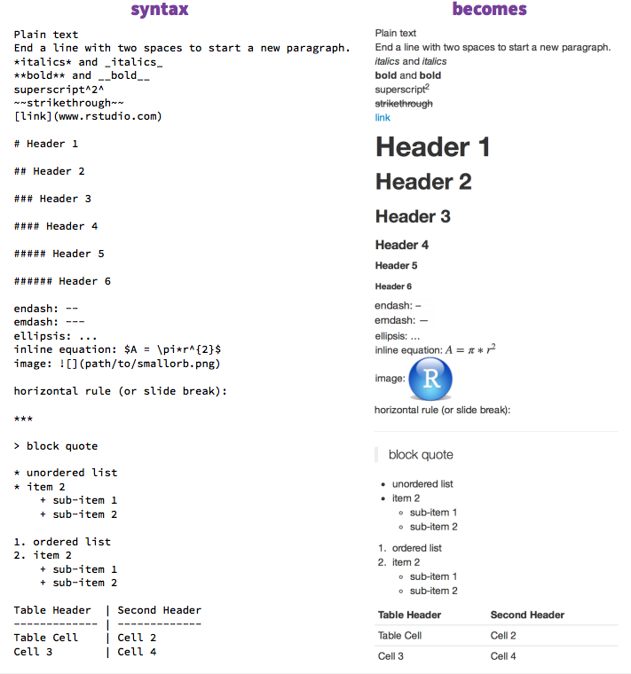

## SCHEDULE FOR SESSION
* Why R?

* Scope of R
    + Data visualization
    + Data manipulation/summarizing
    + Data analysis/modeling
    + Interpretation of results

* What is R Markdown?
    + Reproducible research
    + Dynamic documents

* What is Github
    + Version control

## Who are we?

### Robert Schlegel 
My name is rob and I love fish and kelp

### Morgan Brand
> * I am a PhD student at the University of Cape Town
> * My interests are, aquaculture, microbiolgy, reproducibility and collaboration

## WHY R?

## THE TRADITIONAL APPROACH TO REPORTS / ANALYSIS IN THE SCIENCES
* Import data set into statistical software package
* Run the procedure to get results
* Copy and paste appropriate pieces from the analysis into document editor
* Add descriptions
* Finish/submit report

## DISADVANTAGES OF THIS PROCESS
* Lots of manual work (prone to make errors)

* Tedious (who likes to carefully copy-and-paste?)

* Likely not recordable (did you write down all the steps you followed to get your analysis?)

* What if you made an error at the beginning of your analysis? If your data had an error?

## WHAT IS R?
* R is a completely free software package and language for statistical analysis and graphics.

* It excels in helping you with
    + data manipulation
    + automation
    + reproducibility
    + improved accuracy
    + error finding
    + customizability
    + beautiful visualizations
    + Any downsides?

## WHAT IS MARKDOWN?
* A “plaintext formatting syntax”
* Type in plain text, render to more complex formats
* One step beyond writing a txt file
* Render to HTML, PDF, DOCX, etc.

## WHAT DOES IT LOOK LIKE

